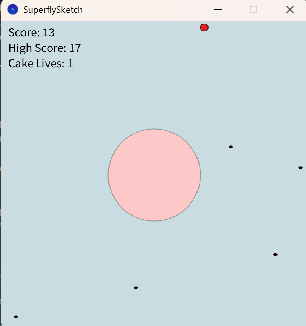

# Superfly

Superfly is a small arcade-style game built with Java and Processing. The player clicks moving flies before they reach a cake; normal flies score one point, a faster super fly scores two, and the game ends when the cake loses all four lives.

The project began as a Processing/Java coursework sketch. It has since been migrated to a conventional Java 17 application with a Gradle build, a Processing-independent gameplay layer, JUnit tests, and isolated file-based high-score persistence. The active application is the Gradle project under `src/main/java`. The `legacy-processing/` directory preserves the original coursework version for reference and comparison.



## Technologies

- Java 17
- Processing Core 4.5.3
- Gradle 9.7.1 via the Gradle Wrapper
- JUnit Jupiter 5.13.4
- Java NIO `Path` and `Files` for persistence

## Build, test, and run

The Gradle Wrapper means a separate Gradle installation is not required. A Java 17 JDK is required.

On Windows:

```powershell
.\gradlew.bat clean build
.\gradlew.bat test
.\gradlew.bat run
```

On macOS or Linux:

```bash
./gradlew clean build
./gradlew test
./gradlew run
```

`build` compiles the application, runs the tests, and creates packaged output under `build/`. The current suite contains 25 deterministic domain and persistence tests. Processing rendering itself is not unit tested.

## Architecture

`SuperflySketch` is the Processing adapter. It receives frame and mouse events, loads images, renders the current state, and delegates gameplay decisions to `Game`.

```text
Processing UI / Input
          |
          v
         Game
       /   |    \
   Cake  Enemies  Explosions
```

The classes under `uk.ac.superfly.game` do not import Processing. Canvas bounds, frame ticks, and randomness are supplied explicitly, and movement calculations use standard Java math. Production uses an unseeded `Random`; tests use seeded instances so enemy placement and game progression are reproducible.

High-score storage is a separate concern:

```text
SuperflySketch
      |
      v
HighScoreRepository
      |
      v
FileHighScoreRepository --> highscore.txt
```

`FileHighScoreRepository` uses Java NIO and replaces the score file through a temporary sibling file. A missing file represents a score of zero. Invalid contents cause a clear exception instead of silently discarding corrupt data.

`highscore.txt` is local runtime data and is intentionally ignored by Git. It is created or updated when a new high score is saved. The existing local file can be deleted to reset the stored score.

## Project structure

```text
.
├── build.gradle
├── settings.gradle
├── gradlew / gradlew.bat
├── gradle/wrapper/
├── src/
│   ├── main/
│   │   ├── java/uk/ac/superfly/
│   │   │   ├── SuperflySketch.java
│   │   │   ├── game/
│   │   │   │   ├── Game.java
│   │   │   │   ├── Cake.java
│   │   │   │   ├── Enemy.java
│   │   │   │   ├── Fly.java
│   │   │   │   ├── SuperFly.java
│   │   │   │   └── Explosion.java
│   │   │   └── persistence/
│   │   │       ├── HighScoreRepository.java
│   │   │       └── FileHighScoreRepository.java
│   │   └── resources/
│   │       ├── fly.png
│   │       └── superfly.png
│   └── test/java/uk/ac/superfly/
│       ├── game/
│       └── persistence/
└── legacy-processing/
    ├── SuperflySketch.pde   Original main Processing sketch
    ├── Cake.pde
    ├── Enemy.pde
    ├── Explosion.pde
    ├── Fly.pde
    ├── Superfly.pde
    └── data/                Original Processing assets
        ├── fly.png
        └── superfly.png
```
